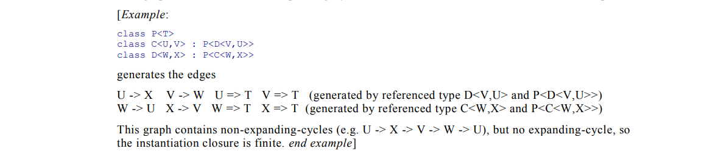

# Lecture 2: Types

## Overview

Practically speaking, a *type* is metadata associated to a variable or parameter in a program.
Proper use of *type annotations* and a *type checker* can help ensure program correctness.
Different *type systems* have different expressive power - some are even turing complete.
Some tools are capable of *type inference,* which can reduce tedious and error prone coding practices.
Some languages offer the ability to read, and even modify, information about types *at runtime.*  Such techniques are broadly called *reflection.*

* Examples...

### History

#### [PEP 3107 – Function Annotations. 02-Dec-2006](https://peps.python.org/pep-3107/)

> This PEP introduces a syntax for adding arbitrary metadata annotations to Python functions
> ... reducing the confusion caused by the wide variation in mechanism and syntax that has existed until this point.
> Function annotations are nothing more than a way of associating arbitrary Python expressions with various parts of a function at compile-time.
> ... this PEP makes no attempt to introduce any kind of standard semantics, even for the built-in types. This work will be left to third-party libraries.
> Once compiled, a function’s annotations are available via the function’s \_\_annotations\_\_ attribute
> The return key was chosen because it cannot conflict with the name of a parameter

This PEP introduces a syntax for annotating parameter and return types of functions.  This metadata would be stored in a `dict` called `\_\_annotations\_\_`.

#### [PEP 484 – Type Hints. 29-Sep-2014](https://peps.python.org/pep-0483/)

> PEP 3107 introduced syntax for function annotations, but the semantics were deliberately left undefined.
> There has now been enough 3rd party usage for static type analysis that the community would benefit from
> a standard vocabulary and baseline tools within the standard library.
> This PEP introduces a provisional module to provide these standard definitions and tools, along with some
> conventions for situations where annotations are not available.
> Note that this PEP still explicitly does NOT prevent other uses of annotations, nor does it require (or forbid)
> any particular processing of annotations, even when they conform to this specification.
> It simply enables better coordination, as PEP 333 did for web frameworks.

> No first-class syntax support for explicitly marking variables as being of a specific type is added by this PEP.

Here the **`typing`** module is introduced, and the rational is described in detail.
This set the stage for the typing tools that followed.

#### [PEP 483 – The Theory of Type Hints. 19-Dec-2014](https://peps.python.org/pep-0483/)


#### [What’s New In Python 3.5. 13-Sep-2015](https://docs.python.org/3.5/whatsnew/3.5.html)

* **`typing`: PEP 484 – Type Hints.**
* **PEP 492, coroutines with async and await syntax.**

#### [PEP 526 – Syntax for Variable Annotations. 09-Aug-2016](https://peps.python.org/pep-0483/)

> This PEP aims at adding syntax to Python for annotating the types of variables (including class variables and
> instance variables), instead of expressing them through comments.
> **It should also be emphasized that Python will remain a dynamically typed language, and the authors have no desire
> to ever make type hints mandatory, even by convention.**
> The goal of annotation syntax is to provide an easy way to specify structured type metadata for third party tools.

#### [What’s New In Python 3.6. 23-Dec-2016](https://docs.python.org/3.6/whatsnew/3.6.html)

* **PEP 498, formatted string literals.**
* **PEP 526, syntax for variable annotations.**

#### **Today**

We can look at the git repo for pyright, and see

```
commit 60c76da87d85a24d4b06009eae224d0363349f44
Author: Microsoft GitHub User <msftgits@microsoft.com>
Date:   Mon Mar 11 20:38:47 2019 -0700

    Initial commit
```

And at *PyPi* to find that it's initial release was *Jun 20, 2021*.

# 

TODO: come up with a "framework" for demonstrating the type systems I want to show...

## Simple Types

* definition, usage in python, checking, inference
* implicational fragment of predicate logic
* __WARNING: MATH__ Types as Trees

## Recursive Types

* definition, usage in python, checking, inference
* typing the Y-Combinator
* __WARNING: MATH__ Recursive-types as Trees, regular-languages

## Subtype-Polymorphism

### Nominal Subtyping

* inheritance + transitivity
* definition, usage in python, checking, inference

### Structural Subtyping

* *ducktyping*
* definition, usage in python, checking, inference

## Generalized Type Systems

Functions are of the `kind`: `value -> value`

Other `kinds` include:
* `value -> Type` - think of overloaded functions
* `Type -> Type` - think of generic containers
* `Type -> value` is less interesting, but we can encode computation into the type system...

### Ad-hoc Polymorphism

* `value -> Type`
* definition, usage in python, checking, inference
* overloads, dependent-types
* first-order logic

### Parametric Polymorphism

* `Type -> Type`
* definition, usage in python, checking, inference
* overloads, dependent-types
* second-order logic
* typing the Y-Combinator

# Assignment:

* Consider the following from **ECMA 335 (5th edition, December 2010) section 9.2**:




## Your task:

<!-- TODO: come up with something to do -->